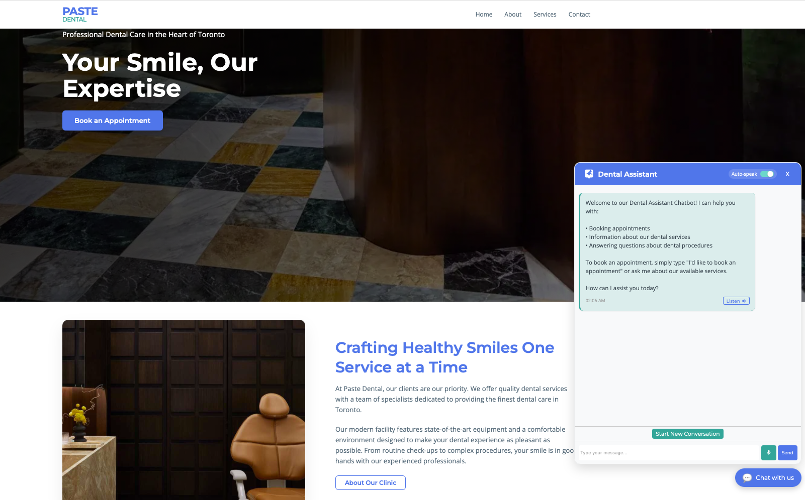

# Dental Chatbot

A comprehensive AI-powered dental appointment and information chatbot built for the Cloud Machine Learning class. This application uses several AWS AI services to create an interactive chatbot that helps patients book appointments and access dental service information.

## Project Architecture

The project is structured with two main components:

1. **Frontend Client**: React-based web application that provides the user interface
2. **Serverless Backend**: AWS Lambda-based API built with Chalice that integrates AWS AI services

### Technology Stack

#### Frontend

- React 19 with TypeScript
- Vite 6 for build tooling
- Axios for API communication
- Custom CSS for styling

#### Backend

- AWS Chalice for serverless framework
- AWS Lambda for executing code
- AWS API Gateway for REST API endpoints
- AWS Lex for natural language understanding
- AWS Polly for text-to-speech
- AWS Transcribe for speech-to-text
- AWS DynamoDB for conversation history
- AWS S3 for conversation storage

